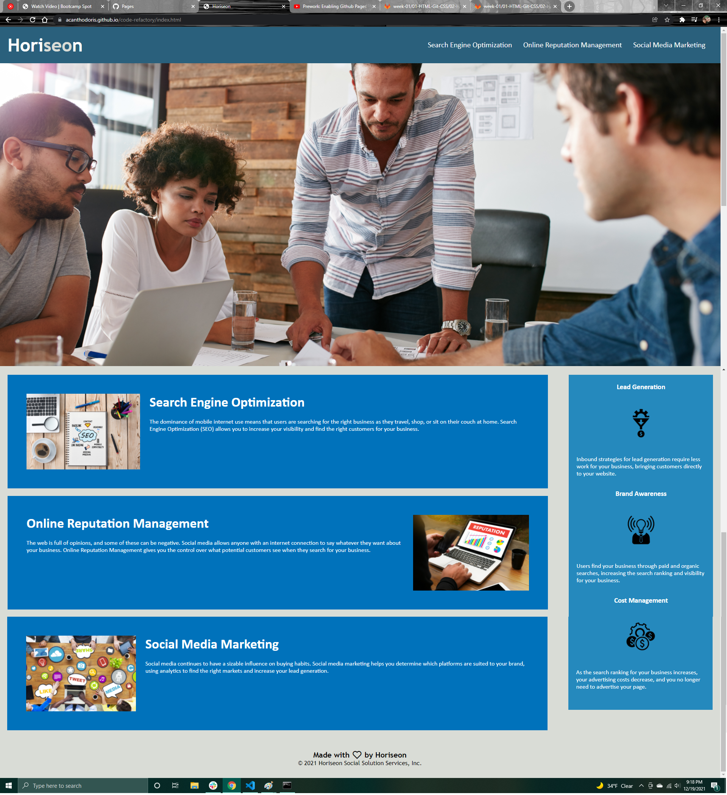

# code-refactorory
Description:
Was tasked with refactoring a previously built webpage for class. With the goal of fixing any broken code, cleaning up the code, and adding accessibility for all users.
 
Changes made:
Updated title to 'Horiseon'
Added id tag to 'search-engine-optimization' class to fix link
Added space between HTML elements for readability
Condensed redunented CSS code to clean up
Added alt text to all images
Added CSS notes

GitHub:
https://github.com/Acanthodoris/code-refactory

GitHub Page:
https://acanthodoris.github.io/code-refactory/index.html

Screenshot:

Credits:
https://www.w3schools.com/css/css_list.asp
https://moz.com/learn/seo/alt-text
https://developer.mozilla.org/en-US/docs/Web/CSS/text-decoration
https://www.w3schools.com/cssref/pr_class_clear.asp
https://github.community/t/how-do-you-put-images-on-the-readme-md-file/576
https://frontstuff.io/should-you-chain-or-extend-css-classes
https://uxdesign.cc/semantic-html-the-foundation-of-web-accessibility-e5bbecad7c17
